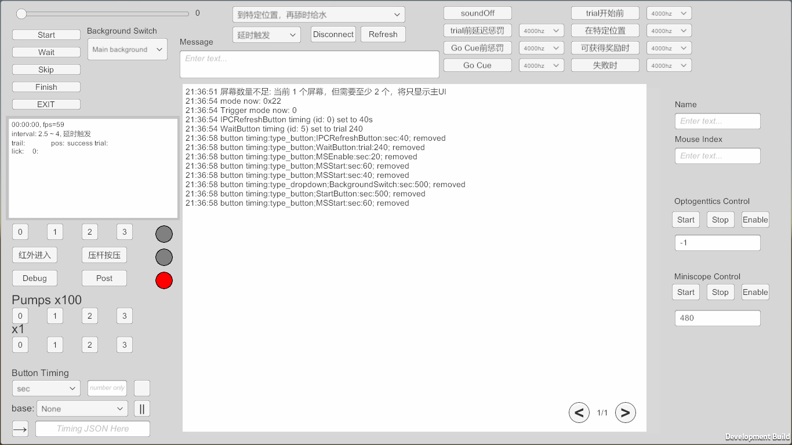

# LEDRingTest Documentation

## Overview

LEDRingTest is a Unity-based behavioral training system for rodents, providing visual stimulus control, reward delivery, and behavioral data collection in an automated training environment.



---

## UI Interface

The main interface is divided into several control panels for different functions:

### Core Control Panel

| Button/Control | Function | Details |
|----------------|----------|---------|
| **Start** | Start Session | Begin the training session with sound cue |
| **Wait** | Pause/Resume | Toggle pause state (显示"pause"时暂停, 显示"continue"时继续) |
| **Finish** | Complete Trial | Manually complete current trial as successful |
| **Skip** | Skip Trial | Skip current trial (marked as manually skipped) |
| **Exit** | Exit Application | Exit with 1 second delay |

### Status Display Panel

| Display | Content |
|---------|---------|
| **High Frequency Info** | Session time (HH:MM:SS), FPS |
| **Fixed Info** | Trigger mode and interval information |
| **Trial Info** | Current trial number, position, lick counts, success/fail statistics, accuracy |

### Input Fields

| Input Field | Function | Usage |
|-------------|----------|-------|
| **Serial Message** | Send commands | - `/variable=value` - Assign variable<br>- `//command` - Raw command<br>- `///variable=value` - Set context property (debug mode)<br>- `///help` - List all properties |
| **Timing (sec)** | Set timing by seconds | Enter seconds, then Ctrl+Shift+Click target button |
| **Timing (trial)** | Set timing by trial count | Enter trial count, then Ctrl+Shift+Click target button |
| **Timing Config** | Import/Export timing | Paste JSON config to import, or use Export button |
| **OG Time** | Optogenetics duration | Duration in milliseconds |
| **MS Time** | Miniscope duration | Duration in milliseconds |

### Dropdowns

| Dropdown | Options | Function |
|----------|---------|----------|
| **Mode** | Trial Modes | Select trial mode (see Trial Modes section) |
| **Trigger Mode** | Trigger Modes | Select trigger mode (0=延时, 1=红外, 2=压杆, 3=位置检测, 4=结束) |
| **Background** | Materials | Switch background material |
| **Timing Base** | Timing Hierarchy | Configure button timing chains (use ctrl + shift + left click to create a timming, repeat to cancel) |

### Sound Control Panel

| Button | Function | Details |
|--------|----------|---------|
| **Off** | Disable all sounds | Deselects all other sound options |
| **BeforeTrial** | Play before trial starts | Sound cue before trial begins |
| **NearStart** | Play near start | After trigger delay, before trial |
| **BeforeGoCue** | Play before go cue | After trial starts, before go cue |
| **BeforeLickCue** | Play before lick enabled | After go cue, before licking enabled |
| **InPos** | Play in position | When mouse is in correct position (not playable) |
| **EnableReward** | Play on reward available | When reward can be obtained |
| **AtFail** | Play on failure | When trial fails |

Each sound button has an embedded dropdown to select the audio clip. **Shift+Click** to preview the sound.

### Device Control Panel

| Button | Function | Details |
|--------|----------|---------|
| **OG Start** | Start optogenetics | Duration set by OG Time input |
| **OG Stop** | Stop optogenetics | Immediately stop |
| **OG Enable** | Toggle OG enable | Green=enabled, default=disabled |
| **MS Start** | Start miniscope | Duration set by MS Time input |
| **MS Stop** | Stop miniscope | Immediately stop |
| **MS Enable** | Toggle MS enable | Green=enabled, default=disabled |

### Simulation Controls

| Button | Function | Details |
|--------|----------|---------|
| **Lick Spout 1-8** | Simulate lick | Simulate lick at specified spout |
| **Water Spout 1-8** | Dispense water | Dispense water for 0.2s |
| **Water Spout Single 1-8** | Single dispense | Same as above |
| **Shift+Click Water Spout** | Flush | Flush water spout (`/p_water_flush[n]=1`) |
| **IR In** | Simulate IR sensor | Trigger entrance detection |
| **Press Lever** | Simulate lever press | Trigger lever press detection |

### Utility Buttons

| Button | Function |
|--------|----------|
| **Debug** | Toggle debug mode (Green=enabled) |
| **IPC Refresh** | Refresh IPC connection (Green=connecting) |
| **IPC Disconnect** | Disconnect IPC |
| **Page Up/Down** | Navigate log pages |
| **Timing Export** | Export timing config to input field |
| **Timing Pause** | Pause/resume all timing alarms |
| **Message Post** | Send WeChat notification |

### Light Indicators

| Light | Color | Meaning |
|-------|-------|---------|
| **Lick** | Green (on) / Grey (off) | Lick detected |
| **Reward** | Cyan (on) / Grey (off) | Reward served |
| **Stop** | Red (on) / Grey (off) | Stop signal |

### Log Window

- Displays real-time log messages with timestamps
- Scrollable with Page Up/Down buttons
- Auto-scrolls when not manually scrolling

---

## Configuration (config.ini)

The configuration file is located at:
- **Editor**: `Assets/Resources/config.ini`
- **Build**: `Buildings/LEDRingTest_Data/Resources/config.ini`

### Value Format: Random Ranges

Many parameters support random value specification using the format `randomX~Y`:
- `random2.5~4` - Random value between 2.5 and 4
- `5` - Fixed value of 5

### Settings Section

| Parameter | Format | Description |
|-----------|--------|-------------|
| `start_mode` | hex (0x00, 0x01, 0x10, 0x11, 0x21, 0x22) | Trial reward mode. **First hex digit**: 0x0_=reward at trial start, 0x1_=reward on success. **Second hex digit**: _0=any lick advances, _1=correct lick advances, _2=position-based |
| `triggerMode` | int (0-4) | 0=delay, 1=IR sensor, 2=lever press, 3=position detection, 4=trial end |
| `start_method` | string | Position selection method: `random` or `assign`. Append positions after `random` (e.g., `random0,90,180`) to limit random selection to specific indices |
| `available_pos` | comma-separated ints | Available bar positions in degrees (0-359). Index mapping: 0→first value, 1→second, etc. |
| `assign_pos` | pattern | Position assignment pattern (see Position Assignment Syntax below) |
| `barShiftLs` | pattern or randomX~Y | Bar position offset per trial (supports same patterns as `assign_pos`, or `random-80~80` for random range) |
| `barOffset` | int | Constant display offset in degrees (added to all positions) |
| `pump_pos` | comma-separated ints | Pump number for each `available_pos` index (count must ≥ `available_pos` count, or empty for auto-index 0,1,2...) |
| `lick_pos` | comma-separated ints | TouchPanel/lick spout number for each `available_pos` index (same rules as `pump_pos`) |
| `MatStartMethod` | string | Material selection method: `random` or `assign` |
| `MatAssign` | pattern | Material assignment pattern (same syntax as `assign_pos`) |
| `MatAvailable` | comma-separated | Available material names (must match `[matSettings] matList`) |
| `max_trial` | int | Maximum number of trials |
| `barDelayTime` | float | Minimum time between trials (active trigger modes) |
| `barLastingTime` | float | Bar display duration after successful trial (0=immediate hide) |
| `triggerModeDelay` | randomX~Y or float | Delay before trial starts (trigger mode 0: sound cue lead time; modes 1-3: post-trigger delay) |
| `trialInterval` | randomX~Y or float | Interval between trials (mode 0: actual interval; modes 1-4: minimum interval) |
| `success_wait_sec` | randomX~Y or float | Wait time after success (used when `trialInterval` not set) |
| `fail_wait_sec` | randomX~Y or float | Wait time after failure (used when `trialInterval` not set) |
| `waitFromStart` | randomX~Y or float | Go cue delay after trial starts |
| `waitFromLastLick` | float | Delay trial start if mouse licking at session start |
| `trialExpireTime` | float | Trial timeout before auto-fail |
| `backgroundLight` | int (0-255) | Background brightness level |
| `backgroundLightRed` | int (-1 to 255) | Red component override; -1=grayscale mode, 0-255=fixed red level |
| `seed` | int | Random seed (-1=use current time) |
| `standingSecInTrial` | float | Standing time required in trigger/destination zones |

### Position/Material Assignment Syntax

Used by: `assign_pos`, `MatAssign`, `barShiftLs` (when not using random range)

| Pattern | Example | Description |
|---------|---------|-------------|
| Single value | `0` | Use index 0 for one trial |
| Comma sequence | `0,1,2,3` | Use indices 0,1,2,3 in order |
| Repeat with `..` | `0..` | Use index 0 for all remaining trials |
| Multiplier | `0*10` | Use index 0 for 10 trials |
| Sum pattern | `(0+90+180+270)*4..` | Treat sum as sequence, repeat 4 times, then continue |
| Range pattern | `(0-1-2)*5..` | Sequence 0,1,2 repeated 5 times, then continue |
| Combined | `0*30,1*30` | Index 0 for 30 trials, then index 1 for 30 trials |
| Random unit | `random0~20*10` | Random value 0-20 for 10 trials (in `barShiftLs` only) |

**Note**: Position indices refer to `available_pos` index (0-7), NOT degrees. Material indices refer to `MatAvailable`.

### Device Trigger Methods

Format: `[start]{...};[end]{...}` - Each section contains `eventType:trialPattern` separated by `|`

**Event Types**: `certainTrialStart`, `everyTrialStart`, `certainTrialEnd`, `everyTrialEnd`, `certainTrialInTarget`, `everyTrialInTarget`, `nextTrialStart`, `nextTrialEnd`, `nextTrialInTarget`

**Trial Patterns** support:
- `n` - Every nth trial: `80*n` → trials 80, 160, 240...
- `*(n+1)` - Offset by 1: `80*(n+1)` → trials 80, 161, 242...
- Combined: `80*n40+` → trials 120, 200, 280... (80×(n+0)+40)
- `~length` - Range: `1~3` → 3 consecutive trials
- `+offset` / `-offset` - Add/subtract offset
- Comma-separated values: `10,20,30`
- `0` or `1` - Special values (0=not active, 1=active, for `every...` events)

**Example**: `OGTriggerMethod=[start]{everyTrialEnd:30};[end]{nextTrialInTarget:0}`
- Start OG on trial 30 end
- End OG when next trial in-target occurs

### Additional Settings

| Parameter | Format | Description |
|-----------|--------|-------------|
| `refSegement` | int | Reference segment angle (0-359) |
| `destAreaFollow` | bool | If `true`, destination area rotates with bar position; if `false`, uses fixed area |
| `extraRewardTimeInSec` | float | Extra reward period duration after trial success (0=disabled, -2=unlimited) |
| `stopExtraRewardMethod` | comma-separated | Methods to stop extra reward: `lick`, `pos`, or `lick,pos` |
| `stopExtraRewardUseTriggerSelectArea` | int | Which trigger area index to use for position-based stopping |
| `stopExtraRewardLickDelaySec` | float | Delay after lick before stopping extra reward |
| `ServeRandomRewardAtEnd` | randomX~Y or int | Number of random rewards to serve at session end |
| `refSegement` | int | Reference segment angle (0-359) |
| `checkConfigContent` | bool | Enable config validation checks |
| `openLogevent` | bool | Enable external logging via LogEvent.exe |
| `logEventPath` | string | Path to LogEvent.exe |
| `openPythonScript` | bool | Enable Python script integration (for video tracking) |
| `PythonScriptCommand` | string | Python script command line |
| `closePythonScriptBeforeExit` | bool | Close Python script on exit |

### Sound Settings

| Parameter | Format | Description |
|-----------|--------|-------------|
| `soundLength` | float | Sound cue duration in seconds (0=disabled) |
| `cueVolume` | float (0-1) | Cue sound volume (0=mute, 1=max) |
| `TrialSoundPlayMode` | string | Format: `ModeNumber:SoundName` (e.g., `6:6000hz`). Modes: 0=Off, 1=BeforeTrial, 2=NearStart, 3=BeforeGoCue, 4=BeforeLickCue, 5=InPos, 6=EnableReward, 7=AtFail. Separate multiple with `;` |
| `alarmPlayTimeInterval` | float | Minimum interval between alarm sounds (seconds, only used when `soundLength` > 0) |

### Display Settings

| Parameter | Type | Description |
|-----------|------|-------------|
| `barWidth` | int | Bar display width in pixels |
| `barHeight` | int | Bar display height in pixels |
| `displayPixelsLength` | int | Screen horizontal width in pixels |
| `displayPixelsHeight` | int | Screen vertical height in pixels |
| `isRing` | bool | Enable ring display mode (repeats bar pattern) |
| `separate` | bool | Use separate display regions |
| `displayVerticalPos` | float (0-1) | Vertical screen position (0.5=center) |

### Serial Settings

| Parameter | Format | Description |
|-----------|--------|-------------|
| `serialSpeed` | int | Baud rate (e.g., 250000) |
| `blackList` | comma-separated | COM ports to ignore (e.g., `COM1,COM3`) |
| `compatibleVersion` | comma-separated | Arduino firmware versions to accept (e.g., `V2.2`) |

### Material Settings

| Parameter | Format | Description |
|-----------|--------|-------------|
| `matList` | comma-separated | All available material names defined in config |
| `centerShaft` | bool | Enable center reference shaft display |

#### Per-Material Properties (e.g., `[barMat]`, `[barMat2]`, `[centerShaft]`)

| Parameter | Type | Description |
|-----------|------|-------------|
| `isDriftGrating` | bool | Use animated drifting grating stimulus |
| `isCircleBar` | bool | Render bar as circle instead of rectangle |
| `speed` | float | Drift animation speed |
| `frequency` | int | Grating stripe frequency |
| `direction` | `left` or `right` | Drift direction |
| `horizontal` | float (0-1) | Motion angle: 0=horizontal, 1=vertical, values between=diagonal |
| `mat` | string or #RRGGBB | Texture name (without .png) or hex color code |

### Default Option Settings

Stored in `InputfieldContent` as JSON-encoded timing chains for automated UI control.

Format: `IFTimingSet=>JSON1|||JSON_RECORD|||JSON2|||JSON_RECORD|||...`

---

## UI Controls Reference

### Core Buttons

| Button Name | Function | Description |
|-------------|----------|-------------|
| `StartButton` | Start Session | Begin trial session with sound cue |
| `WaitButton` | Pause/Resume | Toggle pause state |
| `FinishButton` | Complete Trial | Manually complete current trial |
| `SkipButton` | Skip Trial | Skip current trial |
| `ExitButton` | Exit | Exit application (1s delay) |
| `DebugButton` | Debug Mode | Toggle debug mode |

### Input Fields

| Input Field | Function | Usage |
|-------------|----------|-------|
| `IFSerialMessage` | Serial Commands | Send commands to Arduino (prefix with `/` for variable assignment, `//` for raw) |
| `IFTimingBySec` | Timing (sec) | Set button timing in seconds |
| `IFTimingByTrial` | Timing (trial) | Set button timing by trial count |
| `IFTimingSet` | Timing Config | Import/export timing configuration |
| `OGTime` / `MSTime` | Device Duration | Set optogenetics/miniscope duration (ms) |
| `MouseInfoName` | Mouse Name | Set mouse identifier |
| `MouseInfoIndex` | Mouse Index | Set mouse index |

### Dropdowns

| Dropdown | Options | Function |
|----------|---------|----------|
| `ModeSelect` | Trial Modes | Select trial mode (0x00, 0x01, 0x10, 0x11, 0x21, 0x22) |
| `TriggerModeSelect` | Trigger Modes | Select trigger mode (0-4) |
| `BackgroundSwitch` | Materials | Switch background material |
| `TimingBaseDropdown` | Timing Config | Configure button timing hierarchy |

### Sound Controls (sound Options)

| Button | Function |
|--------|----------|
| `soundOff` | Disable all sounds |
| `soundBeforeTrial` | Play sound before trial starts |
| `soundNearStart` | Play sound near trial start |
| `soundBeforeGoCue` | Play sound before go cue |
| `soundBeforeLickCue` | Play sound before lick cue |
| `soundInPos` | Play sound in position |
| `soundEnableReward` | Play sound when reward enabled |
| `soundAtFail` | Play sound on failure |

Each sound button has an embedded dropdown to select the audio clip.

### Device Controls

| Button | Function |
|--------|----------|
| `OGStart` | Start optogenetics device |
| `OGStop` | Stop optogenetics device |
| `OGEnable` | Toggle optogenetics enable |
| `MSStart` | Start miniscope device |
| `MSStop` | Stop miniscope device |
| `MSEnable` | Toggle miniscope enable |

### Lick Spout Simulation

| Button | Function |
|--------|----------|
| `LickSpout1-8` | Simulate lick at spout 1-8 |

### Water Spout Controls

| Button | Function |
|--------|----------|
| `WaterSpout1-8` | Dispense water at spout 1-8 |
| `WaterSpoutSingle1-8` | Single dispense mode |
| Shift + Click | Flush water spout |

### Timing Controls

| Button | Function |
|--------|----------|
| `TimingConfigExport` | Export timing config to input field |
| `TimingPause` | Pause/resume all timing alarms |

### Utility Buttons

| Button | Function |
|--------|----------|
| `PageUp` / `PageDown` | Navigate log pages |
| `IPCRefreshButton` | Refresh IPC connection |
| `IPCDisconnect` | Disconnect IPC |
| `MessagePost` | Send WeChat notification |

---

## ContextInfo Properties (Runtime Modifiable)

These properties can be modified at runtime using the serial command `///variableName=value` when debug mode is enabled.

| Property | Type | Description |
|----------|------|-------------|
| `startMethod` | string | Position selection method |
| `avaliablePosDict` | Dictionary<int,int> | Available position mapping |
| `matStartMethod` | string | Material selection method |
| `matAvaliableArray` | List<string> | Available materials |
| `lickPosLs` | List<int> | Lick position assignments |
| `pumpPosLs` | List<int> | Pump position assignments |
| `trackMarkLs` | List<int> | Tracking mark assignments |
| `barShiftLs` | List<int> | Bar shift values |
| `barOffset` | int | Display offset |
| `destAreaFollow` | bool | Track actual bar position |
| `standingSecInTrigger` | float | Standing time in trigger zone |
| `standingSecInDest` | float | Standing time in destination |
| `maxTrial` | int | Maximum trials |
| `seed` | int | Random seed |
| `barDelayTime` | float | Bar delay |
| `barLastingTime` | float | Bar duration |
| `waitFromStart` | List<float> | Go cue delay range |
| `waitFromLastLick` | float | Post-lick delay |
| `backgroundLight` | int | Background brightness |
| `backgroundRedMode` | int | Red component |
| `trialInterval` | List<float> | Inter-trial interval |
| `sWaitSec` | List<float> | Success wait time |
| `fWaitSec` | List<float> | Failure wait time |
| `trialTriggerMode` | int | Trigger mode |
| `trialTriggerDelay` | List<float> | Trigger delay |
| `trialExpireTime` | float | Trial timeout |
| `soundLength` | float | Sound duration |
| `cueVolume` | float | Sound volume |
| `countAfterLeave` | bool | Count licks after leaving |
| `extraRewardTimeInSec` | float | Extra reward duration |
| `stopExtraRewardMethod` | string | Extra reward stop method |
| `stopExtraRewardUseTriggerSelectArea` | int | Stop area index |
| `stopExtraRewardLickDelaySec` | float | Stop lick delay |
| `minIgnoreLickInterval` | float | Minimum ignore interval |
| `maxExtraRewardCount` | int | Maximum extra rewards |
| `randomRewardPerTrial` | List<int> | Random rewards per trial |
| `userName` | string | User/mouse name |
| `mouseInd` | string | Mouse index |

---

## Serial Commands

### Variable Assignment
```
/variableName=value
```
Example: `/p_water_flush[1]=1`

### Raw Commands
```
//command
```

### Runtime Property Modification (Debug Mode Only)
```
///variableName=value
```

### Help Command
```
///help
```
Lists all available properties and their types.

---

## Trial Modes

| Mode | Hex | Reward Timing | Advancement Condition |
|------|-----|---------------|----------------------|
| Always, Any Lick | 0x00 | At trial start | Any lick advances |
| Result-Based, Correct Lick | 0x01 | On success only | Correct lick only advances |
| Always, Complete | 0x10 | At trial start | Must complete in position |
| Result-Based, Complete | 0x11 | On success only | Must complete in position |
| Always, Position | 0x21 | At trial start | Position-based advancement |
| Result-Based, Position | 0x22 | On success only | Position-based advancement |

**Hex digit breakdown**: `0xAB`
- **A (first digit)**: Reward timing - `0`=at trial start, `1`=on success
- **B (second digit)**: Advancement condition - `0`=any lick, `1`=correct lick, `2`=position-based

---

## Trigger Modes

| Mode | Description |
|------|-------------|
| 0 | Delay - Fixed interval between trials |
| 1 | IR Sensor - Infrared sensor triggers trial |
| 2 | Lever Press - Pressing lever triggers trial |
| 3 | Position Detection - Video position detection |
| 4 | Trial End - Start immediately after previous trial |

---

## Position Assignment Syntax

See [Configuration - Position/Material Assignment Syntax](#configuration) for complete documentation.

**Quick reference**:
- `0..` - Repeat index 0 for all trials
- `0*30,1*30` - Index 0 for 30 trials, then index 1 for 30 trials
- `(0-1-2)*5..` - Sequence 0,1,2 repeated 5 times, then continued
- `random0,90,180` - Random selection from specified indices

---

## Sound Modes

| Mode | Trigger Point |
|------|---------------|
| 0 (Off) | No sound |
| 1 (BeforeTrial) | Before trial starts |
| 2 (NearStart) | Near trial start (after delay) |
| 3 (BeforeGoCue) | Before go cue |
| 4 (BeforeLickCue) | Before lick is enabled |
| 5 (InPos) | When in correct position |
| 6 (EnableReward) | When reward is available |
| 7 (AtFail) | On trial failure |

---

## Logging and Data

### Record Types
- `lick` - Lick event
- `start` - Trial start
- `end` - Trial end
- `init` - Initialization
- `entrance` - Entrance detected
- `press` - Lever press
- `lickExpire` - Lick timeout
- `trigger` - Trigger event
- `stay` - Stay event
- `soundplay` - Sound playback
- `OGManuplate` - Optogenetics manipulation
- `sync` - Sync event
- `miniscopeRecord` - Miniscope recording
- `pump` - Pump activation

### Log File Output
- Trial information logged to file with timestamps
- Context info exported as JSON at session end
- Real-time display in UI log window

---

## Timing System

### Button Timing

Set timed button presses using Ctrl+Shift+Click or specify timing values:

#### By Time (seconds)
1. Enter value in `IFTimingBySec` input field
2. Ctrl+Shift+Click target button
3. Button executes after specified time

#### By Trial Count
1. Enter value in `IFTimingByTrial` input field
2. Ctrl+Shift+Click target button
3. Button executes after specified trial count

### Hierarchy Timing

Create complex timing chains:
1. Select base timing from dropdown
2. Add child timings with delay
3. Export/import timing configurations

### Timing Commands
- Ctrl+Click button - Remove timing
- Shift+Click sound button - Preview sound

---

## Keyboard Shortcuts

| Key | Function |
|-----|----------|
| Return | Execute input field command |
| Up/Down Arrow | Navigate serial command history |
| Ctrl+Shift+Click | Set button timing |
| Shift+Click | Preview sound |

---

## Build Configuration

Custom images should be placed in the same directory as the config file.

---

## Troubleshooting

### Common Issues

1. **Serial Connection Failed**
   - Check `serialSettings.blackList` in config.ini
   - Verify Arduino is connected

2. **IPC Connection Failed**
   - Click `IPCRefreshButton` to reconnect
   - Check Python script path

3. **Config Parse Error**
   - Verify syntax in config.ini
   - Check for typos in parameter names

4. **Position Assignment Error or something like this**
   - Ensure position indices are within `available_pos` range
   - Verify pattern syntax in the config

---

## Version History

See git log for detailed changes.

---