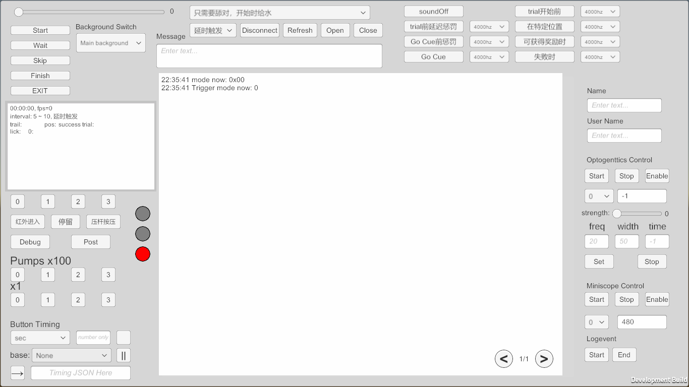

# LEDRingTest 文档

## 项目概述

LEDRingTest 是一个基于 Unity 的啮齿动物行为训练系统，提供视觉刺激控制、奖励发放和行为数据收集功能，适用于自动化训练环境。



---

## 启动流程与初始菜单（StartMenu）

应用启动先进入 **StartMenu** 场景（构建场景顺序：StartMenu → MainScene）。菜单扫描配置目录（编辑器 `Assets/Resources/`，构建 `..._Data/Resources/`）下所有以 `config` 开头、`.ini` 结尾的文件，每个配置显示为一个横条。

| 操作/控件 | 功能 | 说明 |
|-----------|------|------|
| 横条左键 | 以该配置启动 | 进入 MainScene 使用该 config；此后退出返回本菜单 |
| 横条右键 | 配置预览 | 只读预览（见“配置预览”） |
| Refresh | 刷新列表 | 重新扫描目录并重建横条（不重判 skip）；预览期间置灰禁用 |
| Open（预览内） | 打开当前配置文件 | Windows 默认程序打开；文件不存在则先创建空文件再打开 |
| 预览左右箭头 | 翻页 | 在“已设值 N 子页 + 默认未写入 M 子页”扁平序列上循环翻页 |
| 预览排序按钮 | 切换排序 | 原始文本顺序 / 字母顺序 |
| Exit（MainScene） | 退出 | 从菜单进入时返回 StartMenu；skip 或直接启动时关闭应用 |

- 横条显示信息由 `StartMenuController.barDisplayKeys`（格式 `section:key`）指定。
- 无匹配配置时显示单个 `default` 条目（指向默认 `config.ini`，即使为空/缺失）。

### 跳过菜单（metaConfig.ini）

| 参数 | 格式 | 说明 |
|------|------|------|
| `[settings] skip` | bool | `true`：启动直接以默认 `config.ini` 进入 MainScene（不显示菜单），退出=直接关闭应用；否则显示菜单 |

### 配置预览

右键横条进入只读预览，分两类：**已设值**（文件中写入且非空的键）与 **默认未写入**（程序会读取但文件未写入的键，展示默认值）。特性：按文本框高度自动分页；两类合并为扁平子页循环翻页；原始/字母排序；超长行按显示宽度截断为省略号；section 之间空一行；预览期间配置列表禁止交互。

---

## 系统功能

### 核心控制面板

| 按钮/控件 | 功能             | 说明                                   |
|-----------|------------------|----------------------------------------|
| **Start** | 开始训练         | 启动训练会话，播放提示音（如配置）    |
| **Wait**  | 暂停/继续        | 切换暂停状态（显示"pause"时暂停）     |
| **Finish**| 完成当前试验     | 手动标记当前试验为成功（lickInd=-2）  |
| **Skip**  | 跳过当前试验     | 手动跳过当前试验（lickInd=-1）        |
| **Exit**  | 退出程序         | 延迟1秒后退出，可启动定时触发            |

### 状态显示面板

| 显示项             | 内容                                   |
|--------------------|----------------------------------------|
| **高频信息**       | 会话时间（HH:MM:SS）、FPS             |
| **固定信息**       | 触发模式和间隔信息（使用 UpdateFreq=-1） |
| **试验信息**       | 当前试验编号、位置、舔次数、成功/失败统计 |

### 输入字段

| 输入字段           | 功能             | 用法                                   |
|--------------------|------------------|----------------------------------------|
| **Serial Message** | 发送命令         | `/变量=值` - 赋值<br>`//命令` - 原始命令<br>`///变量=值` - 调试模式修改属性 |
| **Timing Value**   | 设置时间         | 配合按钮定时使用                       |
| **Timing Config**  | 导入/导出配置    | 粘贴 JSON 配置以导入，或使用导出按钮   |

### 下拉菜单

| 下拉菜单           | 选项             | 功能                                   |
|--------------------|------------------|----------------------------------------|
| **Mode**           | 试验模式         | 选择试验模式（0x00, 0x01, 0x10, 0x11, 0x21, 0x22） |
| **Trigger Mode**   | 触发模式         | 选择触发模式（0=延时，1=红外，2=压杆，3=位置检测，4=结束） |
| **Background**     | 背景材料         | 切换背景材质                          |
| **Timing Base**    | 定时配置基础     | 配置按钮定时层级（支持子定时链）      |
| **Timing Method**  | 定时方式         | 选择定时触发方式（sec, trialStart, trialEnd, trialInTarget, IPCConnect） |

### 声音控制面板

| 按钮               | 声音模式索引     | 触发点                                 |
|--------------------|------------------|----------------------------------------|
| **Off**            | 0                | 关闭所有声音                          |
| **BeforeTrial**    | 1                | 试验开始前播放                            |
| **NearStart**      | 2                | 接近开始时播放（触发延迟后，试验开始前） |
| **BeforeGoCue**    | 3                | 开始提示前播放（试验开始后，开始提示前） |
| **BeforeLickCue**  | 4                | 启用舔食前播放（开始提示后，舔食启用前） |
| **InPos**          | 5                | 位置正确时播放（持续播放，不可手动触发） |
| **EnableReward**   | 6                | 奖励可用时播放                          |
| **AtFail**         | 7                | 失败时播放                              |

每个声音按钮都有一个嵌入式下拉菜单用于选择音频剪辑。**Shift+Click** 预览声音。

### 设备控制面板（光遗传学和显微镜 - OG/MS）

| 按钮               | 功能             | 设备类型 | 说明                             |
|--------------------|------------------|----------|----------------------------------|
| **OG Start**       | 开始光遗传学     | Optogenetics | 持续时间由 OG Time 输入设置（毫秒） |
| **OG Stop**        | 停止光遗传学     | Optogenetics | 立即停止                         |
| **OG Enable**      | 切换 OG 启用     | Optogenetics | 绿色=启用，默认=禁用            |
| **MS Start**       | 开始显微镜       | Miniscope | 持续时间由 MS Time 输入设置（毫秒） |
| **MS Stop**        | 停止显微镜       | Miniscope | 立即停止                         |
| **MS Enable**      | 切换 MS 启用     | Miniscope | 绿色=启用，默认=禁用            |

设备支持通过配置文件设置复杂的触发方法（见设备触发方法部分）。

设备支持 **Arduino** 与 **Pyboard** 两类下位机，连接时自动识别（`spDeviceType`）。OG/MS 支持**多通道**：通过 `OGChannel` / `MSChannel` 下拉选择通道（`all` = 全部，值 -1）。Pyboard 走带通道的板端命令（如 `cmd:msset;<ch>;<on>`、`cmd:ogpwm;<ch>;<freq>;<duty>;<time>`）。

#### OG PWM（仅 Pyboard）

| 控件/输入 | 功能 | 说明 |
|-----------|------|------|
| `OGPWMSet` | 设置并应用 PWM | 通道取自 `OGChannel`；参数取自 `OGPWMFreq/OGPWMWidth/OGPWMTime` |
| `OGPWMStop` | 关闭该路 PWM | 等价 `OGPWMSet(mills=0)`，关闭当前通道 |
| `OGPWMFreq` | 频率(Hz) | 板端针位 1~5000，缺省 20 |
| `OGPWMWidth` | 占空比(%) | 板端针位 1~100，缺省 50 |
| `OGPWMTime` | 时长(ms) | 0=关闭该路，1+=定时后自关，-1=持续 |

Arduino 下 `OGPWMSet` 被忽略（仅 Pyboard 支持）。

### IPC 连接控制

| 按钮               | 功能             | 说明                             |
|--------------------|------------------|----------------------------------|
| **IPC Refresh**    | 刷新 IPC 连接    | 绿色=连接中，用于重新建立 IPC 连接 |
| **IPC Disconnect** | 断开 IPC 连接    | 禁用 IPC 客户端                  |

IPC 连接在以下情况下需要：
- 触发模式为 3（位置检测）
- 试验模式为 0x2x（基于位置）
- 额外奖励停止方法包含 "pos"

### 仿真控制

| 按钮               | 功能             | 说明                                   |
|--------------------|------------------|----------------------------------------|
| **Lick Spout 1-8** | 模拟舔食         | 在指定的舔管上模拟舔食（simulate=true） |
| **Water Spout 1-8**| 喷水             | 喷水 0.2 秒（使用 alarm 设置，executeCount=99） |
| **Water Spout Single 1-8** | 单次喷水 | 喷水 0.2 秒（executeCount=0） |
| **Shift+Click Water Spout** | 冲洗    | 发送命令 `/p_water_flush[n]=1`       |
| **IR In**          | 模拟红外传感器   | 触发入口检测（entrance:-1:In 和 Leave） |
| **Press Lever**    | 模拟压杆         | 触发压杆按下检测（press:-1）          |
| **Slider Pos**     | 手动设置杆位置   | 拖动滑块实时调整杆位置                |

### 调试和实用按钮

| 按钮               | 功能             | 说明                                   |
|--------------------|------------------|----------------------------------------|
| **Debug**          | 切换调试模式     | 绿色=启用，允许运行时修改 ContextInfo 属性 |
| **Page Up**        | 日志页面向上翻页 | 浏览历史日志                          |
| **Page Down**      | 日志页面向下翻页 | 浏览历史日志                          |

### 定时相关按钮

| 按钮               | 功能             | 说明                                   |
|--------------------|------------------|----------------------------------------|
| **Timing Export**  | 导出定时配置     | 将当前定时配置导出到 IFTimingSet 输入字段 |
| **Timing Pause**   | 暂停/恢复定时     | 暂停/恢复所有定时警报（基于 pressCount） |

### 定时配置下拉菜单功能

| 功能               | 操作             | 说明                                   |
|--------------------|------------------|----------------------------------------|
| **delete**         | 删除定时         | 删除选中的定时及其所有子定时           |
| **spread**         | 展开子定时       | 展开显示子定时选项（创建子下拉菜单）   |
| **hide**           | 隐藏子菜单       | 按层级隐藏子菜单                      |

### 鼠标信息输入

| 输入字段           | 功能             | 说明                                   |
|--------------------|------------------|----------------------------------------|
| **MouseInfoName**  | 设置鼠名         | `mouseName` 字段                     |
| **MouseInfoUserName** | 设置用户名      | `userName` 字段                       |

### 灯光指示器

| 灯光               | 颜色             | 触发条件                               | 自动关闭延迟 |
|--------------------|------------------|----------------------------------------|--------------|
| **Lick**           | 绿色（开）/灰色（关） | 检测到舔食                              | -            |
| **Reward**         | 青色（开）/灰色（关） | 奖励已发放                              | 0.2秒       |
| **Stop**           | 红色（开）/灰色（关） | 停止信号（如 ForceWaiting 状态）       | -            |

### 日志窗口

- 实时显示带时间戳（HH:mm:ss）的日志消息
- 可通过 Page Up/Down 按钮翻页查看历史日志
- 手动滚动时（logWindowDraging=1）在5秒后恢复自动滚动
- 日志内容超过8000字符时自动存档到日志列表

---

## 配置文件（config.ini）

项目信息:
版本:2022.3LTS
.Net Framework
包：
https://github.com/spaskhalov/UnityRestSharp
Newtonsoft Json V3.2.1
Post Processing V3.4.0

配置文件位于：
- **编辑器**: `Assets/Resources/config.ini`
- **构建**: `Buildings/LEDRingTest_Data/Resources/config.ini`

此外，同一目录可放置多个 `config*.ini`（由初始菜单列出供选择），以及控制是否跳过菜单的 `metaConfig.ini`。

### 值格式：随机范围

许多参数支持使用 `randomX~Y` 格式的随机值指定：
- `random2.5~4` - 2.5 到 4 之间的随机值
- `5` - 固定值 5

### 设置部分

| 参数               | 格式             | 说明                                   |
|--------------------|------------------|----------------------------------------|
| `start_mode`       | hex (0x00, 0x01, 0x10, 0x11, 0x21, 0x22) | 试验奖励模式。**第一个十六进制数字**：0x0_=试验开始时奖励，0x1_=成功时奖励。**第二个十六进制数字**：_0=任意舔食推进，_1=正确舔食推进，_2=基于位置推进 |
| `triggerMode`      | int (0-4)        | 0=延时，1=红外传感器，2=压杆按下，3=位置信息，4=试验结束 |
| `start_method`     | string           | 位置选择方法：`random` 或 `assign`。在 `random` 后附加位置（例如，`random0,90,180`）以限制随机选择特定索引 |
| `available_pos`    | 以逗号分隔的整数 | 可用的杆位置（以度为单位）。索引映射：0→第一个值，1→第二个，依此类推。 |
| `assign_pos`       | pattern          | 位置分配模式（见位置分配语法部分）    |
| `barShiftLs`       | pattern or randomX~Y | 每个试验的杆位置偏移（支持与 `assign_pos` 相同的模式，或 `random-80~80` 的随机范围） |
| `OGTriggerMethod` | string           | 光遗传学设备触发方法（见设备触发方法部分） |
| `MSTriggerMethod` | string           | 显微镜设备触发方法（见设备触发方法部分） |
| `barOffset`        | int              | 以度为单位的常量显示偏移（添加到所有位置） |
| `pump_pos`         | 以逗号分隔的整数 | 每个 `available_pos` 索引的泵编号（数量必须 ≥ `available_pos` 数量，或为空以自动索引 0,1,2...） |
| `lick_pos`         | 以逗号分隔的整数 | 每个 `available_pos` 索引的触摸面板/舔喷嘴编号（与 `pump_pos` 相同规则） |
| `TrackPosMark`     | 以逗号分隔的整数 | 每个 `available_pos` 索引的跟踪标记编号（空则自动索引 0,1,2...） |
| `MatStartMethod`   | string           | 材料选择方法：`random` 或 `assign`   |
| `MatAssign`        | pattern          | 材料分配模式（与 `assign_pos` 相同语法） |
| `MatAvailable`     | 以逗号分隔的字符串 | 可用的材料名称（必须与 `[matSettings] matList` 匹配） |
| `max_trial`        | int              | 最大试验次数                           |
| `barDelayTime`     | float            | 试验之间的最小时间（主动触发模式）    |
| `barLastingTime`   | float            | 成功试验后杆显示持续时间（0=立即隐藏） |
| `triggerModeDelay` | randomX~Y or float | 试验开始前的延迟（触发模式 0：声音提示前导时间；模式 1-3：触发后延迟） |
| `trialInterval`    | randomX~Y or float | 试验之间的间隔（模式 0：实际间隔；模式 1-4：最小间隔） |
| `success_wait_sec` | randomX~Y or float | 成功后的等待时间（在未设置 `trialInterval` 时使用） |
| `fail_wait_sec`   | randomX~Y or float | 失败后的等待时间（在未设置 `trialInterval` 时使用） |
| `waitFromStart`    | randomX~Y or float | 试验开始后提示开始的延迟             |
| `waitFromLastLick` | float            | 如果鼠标在会话开始时舔食，则延迟试验开始 |
| `trialExpireTime`  | float            | 自动失败前的试验超时                 |
| `backgroundLight`  | int (0-255)      | 背景亮度级别                          |
| `backgroundLightRed`| int (-1 to 255) | 红色分量覆盖；-1=灰度模式，0-255=固定红色级别 |
| `seed`             | int              | 随机种子（-1=使用当前时间）         |
| `standingSecInTrigger` | float        | 在触发区域内所需的站立时间（秒）    |
| `standingSecInTrialInDest` | float    | 在目标区域内所需的站立时间（秒）    |

### 位置/材料分配语法

由以下参数使用：`assign_pos`，`MatAssign`，`barShiftLs`（不使用随机范围时）

| 模式               | 示例             | 说明                                   |
|--------------------|------------------|----------------------------------------|
| 单一值             | `0`              | 在一个试验中使用索引 0                 |
| 逗号序列           | `0,1,2,3`        | 按顺序使用索引 0,1,2,3                 |
| 重复与 `..`        | `0..`            | 对所有剩余试验使用索引 0               |
| 乘法器             | `0*10`           | 对 10 个试验使用索引 0                 |
| 和模式             | `(0+90+180+270)*4..` | 将和视为序列，重复 4 次，然后继续     |
| 范围模式           | `(0-1-2)*5..`    | 序列 0,1,2 重复 5 次，然后继续        |
| 组合               | `0*30,1*30`      | 索引 0 进行 30 次试验，然后索引 1 进行 30 次试验 |
| 随机单位           | `random0~20*10`  | 在 10 个试验中随机值 0-20（仅在 `barShiftLs` 中） |

**注意**：位置索引指的是 `available_pos` 索引（0-7），而不是角度。材料索引指的是 `MatAvailable`。

### 设备触发方法（OGTriggerMethod 和 MSTriggerMethod）

用于自动控制光遗传学（OG）和显微镜（MS）设备的复杂触发时机。

**格式**：
```
[start]{triggerMethod1:pattern1|triggerMethod2:pattern2|...};
[end]{triggerMethod3:pattern3|triggerMethod4:pattern4|...}
```

**事件类型**：
- `certainTrialStart` - 特定试验开始时
- `everyTrialStart` - 每次试验开始时
- `certainTrialEnd` - 特定试验结束时
- `everyTrialEnd` - 每次试验结束时
- `certainTrialInTarget` - 特定试验在目标区域时
- `everyTrialInTarget` - 每次试验在目标区域时
- `nextTrialStart` - 下一个试验开始时
- `nextTrialEnd` - 下一个试验结束时
- `nextTrialInTarget` - 下一个试验在目标区域时

**开始 [start] 和结束 [end] 优先级**：
若同一条件同时满足 [start] 和 [end]，[start] 优先执行。

**试验模式（pattern）支持语法**：
- `n` - 每第 n 个试验：`80*n` → 试验 80, 160, 240...
- `*(n+1)` - 偏移1：`80*(n+1)` → 试验 80, 161, 242...
- 组合因子：`80*n,40*(n+1)` → 多个模式
- `~length` - 范围：`1~3` → 连续3个试验
- `+offset` / `-offset` - 加/减偏移
- 以逗号分隔的值：`10,20,30`
- `0` 或 `1` - 特殊值（用于 `every...` 事件时为百分比概率，如30即为30%几率，1=启用，0=禁用）

**示例**：
```
OGTriggerMethod=[start]{everyTrialEnd:30*n};
MSTriggerMethod=[start]{certainTrialInTarget:10,20,30};[end]{everyTrialInTarget:0}
```
说明：
- OG 在每次试验结束时，每30个试验启动一次（试验30,60,90...）
- MS 在试验10、20、30处于目标区域时启动
- MS 在任何时候处于目标区域时结束

---

### 附加设置

| 参数               | 格式             | 说明                                   |
|--------------------|------------------|----------------------------------------|
| `refSegement`      | int              | bar指示块角度位置，用于光电传感器硬件同步（0-359）                   |
| `destAreaFollow`   | bool             | 如果为 `true`，目标区域随bar位置旋转；如果为 `false`，使用固定区域 |
| `countAfterLeave`  | bool             | 弃用                   |
| `extraRewardTimeInSec` | float         | 试验成功后额外奖励期的持续时间（0=禁用，-2=无限制） |
| `stopExtraRewardMethod` | 以逗号分隔的字符串 | 停止额外奖励的方法：`lick`（舔食），`pos`（位置），或 `lick,pos`，用contains判断 |
| `stopExtraRewardUseTriggerSelectArea` | int | 用于基于位置的停止的触发区域索引（-1=未指定） |
| `stopExtraRewardLickDelaySec` | float   | 在一次舔食后停止额外奖励的延迟（秒）     |
| `minIgnoreLickInterval` | float       | 有效舔事件的最小间隔（秒）             |
| `maxExtraRewardCount` | int           | 最多额外奖励次数                      |
| `ServeRandomRewardAtEnd` | randomX~Y or int | 会话结束时提供的随机奖励数量       |
| `checkConfigContent` | bool            | 启用配置验证检查（启动时弹窗列出已读/默认配置供核对） |
| `MSRecordDifferentiate` | bool        | 显微镜记录区分模式 |
| `OGtriggerRandomControl` | bool       | 光遗传学触发的随机控制 |
| `OGtriggerCompensation` | bool        | 光遗传学触发补偿 |
| `openLogEvent`     | bool             | 启用通过 LogEvent.exe 的外部日志记录 |
| `logEventPath`     | string           | LogEvent.exe 的路径（启动后会回写实际路径） |
| `openPythonScript` | bool             | 启用 Python 脚本集成（用于视频跟踪） |
| `PythonScriptCommand` | string         | Python 脚本命令行参数                 |
| `closePythonScriptBeforeExit` | bool    | 退出时关闭 Python 脚本               |
| `strictIPCStatusUpdate` | bool        | 严格 IPC 状态更新模式 |
| `IPCHeartbeat`     | bool             | 启用 IPC 心跳检测 |
| `MouseNameRequired`| bool             | 启动时是否强制要求填写鼠名（默认 true） |
| `MouseName`        | string           | 默认鼠名/用户名 |

### 声音设置

| 参数               | 格式             | 说明                                   |
|--------------------|------------------|----------------------------------------|
| `soundLength`      | float            | 声音提示持续时间（秒）（0=禁用）     |
| `cueVolume`        | float (0-1)      | 提示音量（0=静音，1=最大）           |
| `TrialSoundPlayMode` | string         | 格式：`模式编号:声音名称`（例如，`6:6000hz`）。多个用 `;` 分隔<br>模式：0=Off，1=BeforeTrial，2=NearStart，3=BeforeGoCue，4=BeforeLickCue，5=InPos，6=EnableReward，7=AtFail |
| `alarmPlayTimeInterval` | float       | 警报声音之间的最小间隔（秒，仅在 `soundLength` > 0 时使用） |

### 显示设置

| 参数               | 类型             | 说明                                   |
|--------------------|------------------|----------------------------------------|
| `barWidth`         | int              | 杆显示宽度（像素）                   |
| `barHeight`        | int              | 杆显示高度（像素）                   |
| `displayPixelsLength` | int            | 屏幕水平宽度（像素）                 |
| `displayPixelsHeight` | int           | 屏幕垂直高度（像素）                 |
| `isRing`           | bool             | 启用环形显示模式（重复杆模式）       |
| `separate`         | bool             | 使用单独的显示区域（仅支持双屏1920宽度） |
| `displayVerticalPos` | float (0-1)    | 垂直屏幕位置（0.5=居中，范围-1到2） |
| `disableMainDisplay` | bool           | 禁用主显示区域                       |
| `disableMonitorDisplay` | bool        | 禁用额外监视器显示                       |
| `mainUICameraDisplay` | int           | 主UI相机显示配置（显示器索引，-1=自动） |
| `mainCameraDisplay` | int             | 主相机显示配置（显示器索引，-1=自动） |
| `secondCameraDisplay` | int           | 第二相机显示配置（显示器索引，-1=自动） |
| `cameraMonitorDisplay` | int           | 相机监视器显示配置（显示器索引，-1=自动） |

### 串口设置

| 参数               | 格式             | 说明                                   |
|--------------------|------------------|----------------------------------------|
| `serialSpeed`      | int              | 波特率（默认 115200，例如 250000）    |
| `blackList`        | 以逗号分隔的字符串 | 要忽略的 COM 端口（例如，`COM1,COM3`） |
| `recommendPort`    | 以逗号分隔的字符串 | 优先连接的 COM 端口（例如，`COM7`）。连接时会优先尝试这些端口 |
| `compatibleVersion` | 以逗号分隔的字符串 | 接受的 Arduino 固件版本（例如，`V2.2`） |

**支持的Arduino变量**（`Arduino_var_list`，索引即传输下标 0-10）：
- `p_lick_mode` - 舔食模式（索引0）
- `p_trial` - 当前试验（索引1）
- `p_trial_set` - 试验设置（索引2）
- `p_now_pos` - 当前待给水位置（索引3）
- `p_lick_rec_pos` - 舔水位置（索引4）
- `p_INDEBUGMODE` - 调试模式标志（索引5）
- `p_OGActiveMills` - 光遗传学激活时间（索引6）
- `p_miniscopeRecord` - miniscope记录（索引7）
- `p_waterServeWhenLick` - 舔食时给水（索引8）
- `p_waterServeManual` - 手动给水（索引9）
- `p_lightControl` - led亮度控制（索引10）

**Arduino数组类型变量**：
- `p_waterServeMicros` - 给水时间微秒记录
- `p_lick_count` - 舔水计数
- `p_water_flush` - 持续给水

### 设备类型与重连同步

- **设备类型**：连接时自动识别 `Arduino` / `Pyboard`；Pyboard 支持带通道的 `cmd:msset`、`cmd:ogpwm` 等命令，Arduino 忽略 ogpwm。
- **重连状态快照同步**：运行中周期性向板端请求状态快照（`statusValue`，板端回 `cmd:stv:...`）并缓存；串口重连成功后自动回灌最近一次快照（`ArduinoContextPost`），使板端状态与上位机一致。
- **命令校验失败提示**：串口命令校验连续失败 3 次会弹窗提示，通常意味着连接不稳或固件/波特率不匹配。

### 材料设置

| 参数               | 格式             | 说明                                   |
|--------------------|------------------|----------------------------------------|
| `matList`          | 以逗号分隔的字符串 | 配置中定义的所有可用材料名称（默认 `default,barMat,centerShaftMat,backgroundMat`） |
| `centerShaft`      | bool             | 启用中心参考轴显示                   |
| `centerShaftPos`   | int              | 中心轴位置角度（`[centerShaft]` 节，默认 0） |

#### 每种材料的属性（例如，`[barMat]`，`[barMat2]`，`[centerShaft]`）

**漂移格栅材料**（isDriftGrating=true）：
| 参数               | 类型             | 说明                                   |
|--------------------|------------------|----------------------------------------|
| `isDriftGrating`   | bool             | 使用动画漂移格栅刺激                   |
| `isCircleBar`      | bool             | 将杆渲染为圆形而不是矩形             |
| `speed`            | float            | 漂移动画速度                          |
| `frequency`        | int              | 格栅条纹频率                          |
| `direction`        | `left` or `right` | 漂移方向                             |
| `horizontal`       | float (0-1)      | 运动角度：0=水平，1=垂直，介于两者之间=对角线 |
| `backgroundLight`  | int (0-255)      | 背景亮度级别                          |

**静态材料**（isDriftGrating=false）：
| 参数               | 类型             | 说明                                   |
|--------------------|------------------|----------------------------------------|
| `mat`              | string or #RRGGBB | 纹理名称（不带 .png）或十六进制颜色代码 |
| `width`            | int              | 材料宽度（默认400像素）               |
| `backgroundLight`  | int              | 背景亮度（与 backgroundLightRedMode 取最大值） |

**材料文件路径**：
- 编辑器：`Assets/Resources/{matName}.png`
- 构建：`Data/Resources/{matName}.png`

### 默认选项设置

存储在 `InputfieldContent` 中，用于预填充输入框数值，用于自动化 UI 控制，例如JSON 编码的定时链，

**格式**：
```
IFTimingSet=>{定时JSON1}|JR|{定时JSON2}|JR|...
```

使用 `;;;` 分隔多个输入字段配置：
```
{字段名1}=>{值1};;;{字段名2}=>{值2}
```

### 日志设置

| 参数 | 格式 | 说明 |
|------|------|------|
| `[logSettings] logPath` | 相对路径字符串 | 日志输出子目录（可含正/反斜杠）。实际目录 `<数据目录>/<logPath>/Logs`；为空则 `<数据目录>/Logs`。数据目录：编辑器 `Assets/Resources`，构建 `Application.dataPath`。非法字符自动清除，`..`/绝对路径不会逃出数据目录；非空时启动会在日志窗口提示保存位置。 |

---

## 定时系统详解

定时系统允许创建复杂的自动化任务链，支持层级嵌套和多种触发方式。

### 定时结构 (Timing 结构体)

每个定时项包含以下属性：
- `type` - 控件类型：button, dropdown
- `name` - 控件名称（传递给 ControlsParse）
- `hierarchy` - 层级深度（0=基础，1=子定时，2=孙定时...）
- `time` - 定时设置时间（Unity时间，秒）
- `timingMethod` - 定时触发方法
- `Id` - 唯一标识符
- `parentId` - 父定时项Id（-1表示无父项）
- `parentName` - 父定时项名称
- `value` - 控件值（主要用于dropdown）

### 定时方式

| 方式               | 说明                                   |
|--------------------|----------------------------------------|
| `sec`              | 按秒数定时                             |
| `trialStart`       | 按试验开始次数定时                     |
| `trialEnd`         | 按试验结束次数定时                     |
| `trialInTarget`    | 按进入目标区域次数定时                 |
| `IPCConnect`       | 按 IPC 连接状态定时                    |

### 设置定时的方法

#### Part1：使用 Ctrl+Shift+Click
1. 在 `IFTimingValue` 输入字段中输入定时值
2. 在 `Timing Method` 下拉菜单中选择定时方式
3. 在 `Timing Base` 下拉菜单中选择父定时（可选）
4. Ctrl+Shift+Click 目标按钮

#### Part2：使用定时配置下拉菜单
1. 点击 `Timing Base` 下拉菜单展开选项
2. 选择基础定时或选择 delete 删除现有定时
3. 选择 spread 展开子定时选项
4. 设置定时值和触发方式

#### Part3：导入配置
1. 将 JSON 格式的定时配置粘贴到 `IFTimingSet` 输入字段
2. 按回车键应用配置

**JSON 导出示例**：
```json
{
  "name":"StartButton",
  "hierarchy":0,
  "timingMethod":"type_button;StartButton:sec:5;",
  "type":"button",
  "value":0,
  "Id":1,
  "parentId":-1,
  "parentName":""
}
```

### 定时命令详解

| 操作                  | 快捷键/方式       | 结果                                   |
|-----------------------|-------------------|----------------------------------------|
| 设置定时              | Ctrl+Shift+Click  | 根据输入值设置按钮定时                 |
| 移除定时              | Ctrl+Click        | 删除按钮上的定时                       |
| 移除定时层级          | delete 按钮      | 删除选定定时及其所有子定时             |
| 展开子定时            | spread 按钮      | 创建子定时下拉菜单                     |
| 隐藏子菜单            | 不选择           | 自动隐藏                               |
| 暂停所有定时          | TimingPause 按钮  | 切换所有定时警报的暂停状态             |

### ButtonTriggerDict（试验相关定时）

当定时方式为 trialStart/trialEnd/trialInTarget 时，定时信息存储在 ButtonTriggerDict 中：
- 键格式：`Timing{控件名};{定时Id};{值};{定时方式}`
- 值格式：当前试验编号 + 偏移量

示例：`TimingStartButton;1;1;trialStart` 表示在第1个试验开始后执行 StartButton。

---

## 设备控制协议

### 核心按钮

| 按钮名称           | 功能             | 说明                                   |
|--------------------|------------------|----------------------------------------|
| `StartButton`      | 开始会话         | 开始试验会话并播放提示音              |
| `WaitButton`       | 暂停/继续        | 切换暂停状态                          |
| `FinishButton`     | 完成试验         | 手动完成当前试验                      |
| `SkipButton`       | 跳过试验         | 跳过当前试验                          |
| `ExitButton`       | 退出             | 退出应用程序（延迟1秒）               |
| `DebugButton`      | 调试模式         | 切换调试模式                          |

### 输入字段

| 输入字段           | 功能             | 用法                                   |
|--------------------|------------------|----------------------------------------|
| `IFSerialMessage`  | 串口命令         | 发送命令到 Arduino（`/` 变量赋值，`//` 原始命令，`///` 调试改属性，`~/` 仅日志） |
| `IFTimingValue`    | 定时值           | 定时值输入（配合 `Timing Method` 下拉选择秒/试验等定时方式） |
| `IFTimingSet`      | 定时配置         | 导入/导出定时配置（JSON）           |
| `OGTime` / `MSTime`| 设备持续时间     | 设置光遗传学/显微镜持续时间（毫秒）  |
| `MouseInfoName`    | 鼠名             | 设置 `mouseName` 字段                |
| `MouseInfoUserName`| 用户名           | 设置 `userName` 字段                  |
| `OGPWMFreq` / `OGPWMWidth` / `OGPWMTime` | OG PWM 参数 | 频率Hz / 占空比% / 时长ms（见 OG PWM，仅 Pyboard） |

### 下拉菜单

| 下拉菜单           | 选项             | 功能                                   |
|--------------------|------------------|----------------------------------------|
| `ModeSelect`       | 试验模式         | 选择试验模式（0x00, 0x01, 0x10, 0x11, 0x21, 0x22） |
| `TriggerModeSelect`| 触发模式         | 选择触发模式（0-4）                   |
| `BackgroundSwitch` | 材料             | 切换背景材质                          |
| `TimingBaseDropdown` | 定时配置       | 配置按钮定时层级                      |
| `OGChannel` / `MSChannel` | 设备通道   | 选择 OG/MS 通道，含 all(-1)          |

### 声音控制（声音选项）

| 按钮               | 功能             |
|--------------------|------------------|
| `soundOff`         | 禁用所有声音     |
| `soundBeforeTrial` | 试验前播放声音   |
| `soundNearStart`   | 接近开始时播放   |
| `soundBeforeGoCue` | 开始提示前播放   |
| `soundBeforeLickCue` | 启用舔食前播放 |
| `soundInPos`       | 位置正确时播放   |
| `soundEnableReward`| 奖励可用时播放   |
| `soundAtFail`      | 失败时播放       |

每个声音按钮都有一个嵌入式下拉菜单用于选择音频剪辑。

### 设备控制

| 按钮               | 功能             |
|--------------------|------------------|
| `OGStart`          | 开始光遗传学设备 |
| `OGStop`           | 停止光遗传学设备 |
| `OGEnable`         | 切换光遗传学启用 |
| `OGLightControl`   | 光遗传学灯光控制 |
| `MSStart`          | 开始显微镜设备   |
| `MSStop`           | 停止显微镜设备   |
| `MSEnable`         | 切换显微镜启用   |
| `MSLightControl`   | 显微镜灯光控制   |
| `OGPWMSet`         | 设置 OG PWM（Pyboard）：通道=OGChannel，参数=OGPWMFreq/Width/Time |
| `OGPWMStop`        | 关闭 OG PWM（Pyboard）：等价 OGPWMSet(mills=0) |

### 舔喷嘴仿真

| 按钮               | 功能             |
|--------------------|------------------|
| `LickSpout1-8`     | 在喷嘴 1-8 上模拟舔食 |

### 喷水控制

| 按钮               | 功能             |
|--------------------|------------------|
| `WaterSpout1-8`    | 在喷嘴 1-8 上喷水 |
| `WaterSpoutSingle1-8` | 单次喷水模式   |
| Shift + Click       | 冲洗水喷嘴       |

### 定时控制

| 按钮               | 功能             |
|--------------------|------------------|
| `TimingConfigExport` | 导出定时配置到输入字段 |
| `TimingPause`      | 暂停/恢复所有定时警报 |

### 实用按钮

| 按钮               | 功能             |
|--------------------|------------------|
| `PageUp` / `PageDown` | 导航日志页面   |
| `IPCRefreshButton` | 刷新 IPC 连接    |
| `IPCDisconnect`    | 断开 IPC 连接    |
| `MessagePost`      | 发送微信通知（推送目标由 config `[pushSetting] pushTargets` 配置） |
| `OpenPythonScript` | 启动 Python 脚本（根据 config.ini 中的 PythonScriptCommand 配置） |
| `ClosePythonScript`| 关闭当前运行的 Python 脚本 |
| `LogeventStart`    | 开始 LogEvent.exe 外部录制 |
| `LogeventEnd`      | 结束 LogEvent.exe 外部录制 |
| `logScroll`        | 日志滚动条（拖动后 5s 恢复自动滚动） |

`LogeventStart`/`LogeventEnd` 通过后台线程自动点击 LogEvent.exe 的 Record 按钮并自动关闭其模态弹窗，不阻塞 Unity 主线程；若录制未开始，检查 `logEventPath` 与 LogEvent 窗口是否正常。

---

## ContextInfo 属性（运行时可修改）

这些属性可以在调试模式启用时通过串口命令 `///variableName=value` 在运行时修改。

| 属性               | 类型             | 说明                                   |
|--------------------|------------------|----------------------------------------|
| `startMethod`      | string           | 位置选择方法                          |
| `avaliablePosDict` | Dictionary<int,int> | 可用位置映射                          |
| `matStartMethod`   | string           | 材料选择方法                          |
| `matAvaliableArray`| List<string>     | 可用材料                              |
| `lickPosLs`        | List<int>       | 舔食位置分配                          |
| `pumpPosLs`        | List<int>       | 泵位置分配                            |
| `trackMarkLs`      | List<int>       | 跟踪标记分配                          |
| `barShiftLs`       | List<int>       | 杆偏移值                              |
| `barOffset`        | int              | 显示偏移                              |
| `destAreaFollow`   | bool             | 跟踪实际杆位置                        |
| `standingSecInTrigger` | float        | 在触发区域的站立时间                  |
| `standingSecInDest`| float            | 在目标区域的站立时间                  |
| `maxTrial`         | int              | 最大试验次数                          |
| `seed`             | int              | 随机种子                              |
| `barDelayTime`     | float            | 杆延迟时间                            |
| `barLastingTime`   | float            | 杆持续时间                            |
| `waitFromStart`    | List<float>      | 开始提示延迟范围                      |
| `waitFromLastLick` | float            | 最后舔食后的延迟                      |
| `backgroundLight`  | int              | 背景亮度                              |
| `backgroundRedMode`| int              | 红色分量                              |
| `trialInterval`    | List<float>      | 试验间隔                              |
| `sWaitSec`         | List<float>      | 成功等待时间                          |
| `fWaitSec`         | List<float>      | 失败等待时间                          |
| `trialTriggerMode` | int              | 触发模式                              |
| `trialTriggerDelay`| List<float>      | 触发延迟                              |
| `trialExpireTime`  | float            | 试验超时                              |
| `soundLength`      | float            | 声音持续时间                          |
| `cueVolume`        | float            | 声音音量                              |
| `countAfterLeave`  | bool             | 弃用                        |
| `extraRewardTimeInSec` | float        | 额外奖励时间                          |
| `stopExtraRewardMethod` | string       | 额外奖励停止方法                      |
| `stopExtraRewardUseTriggerSelectArea` | int | 停止区域索引                  |
| `stopExtraRewardLickDelaySec` | float   | 停止舔食延迟                        |
| `minIgnoreLickInterval` | float       | 最小忽略间隔                          |
| `maxExtraRewardCount` | int           | 最多额外奖励                          |
| `randomRewardPerTrial` | List<int>    | 每个试验的随机奖励                    |
| `materialsInfo`    | List<string>     | 材料信息列表                          |
| `manuplateMethods` | string           | OG/MS 设备触发方法的汇总描述文本    |
| `MSRecordDifferentiate` | bool        | 显微镜记录区分模式                    |
| `OGtriggerRandomControl` | bool       | 光遗传学触发随机控制                  |
| `OGtriggerCompensation` | bool        | 光遗传学触发补偿                      |
| `userName`         | string           | 用户/鼠名（公共字段，经 MouseInfo 输入框设置） |
| `mouseName`        | string           | 鼠名（公共字段，经 MouseInfo 输入框设置） |

---

## 串口命令

### 变量赋值
```
/variableName=value
```
示例：`/p_water_flush[1]=1`

### 原始命令
```
//command
```

### 运行时属性修改（仅限调试模式）
```
///variableName=value
```

### 帮助命令
```
///help
```
列出所有可用属性及其类型。

---

## 试验模式

| 模式                 | 十六进制 | 奖励时机         | 推进条件               |
|----------------------|----------|------------------|------------------------|
| 始终，任意舔食       | 0x00    | 试验开始时       | 任意舔食推进           |
| 基于结果，正确舔食   | 0x01    | 仅在成功时       | 仅正确舔食推进         |
| 始终，完成           | 0x10    | 试验开始时       | 必须在位置内完成       |
| 基于结果，完成       | 0x11    | 仅在成功时       | 必须在位置内完成       |
| 始终，基于位置       | 0x21    | 试验开始时       | 基于位置的推进         |
| 基于结果，基于位置   | 0x22    | 仅在成功时       | 基于位置的推进         |

**十六进制数字解析**：`0xAB`
- **A（第一个数字）**：奖励时机 - `0`=在试验开始时，`1`=在成功时
- **B（第二个数字）**：推进条件 - `0`=任意舔食，`1`=正确舔食，`2`=基于位置

---

## 触发模式

| 模式 | 说明             |
|------|------------------|
| 0    | 延时 - 试验之间固定间隔 |
| 1    | 红外传感器 - 红外传感器触发试验 |
| 2    | 压杆按下 - 按下压杆触发试验 |
| 3    | 位置检测 - 视频位置检测 |
| 4    | 试验结束 - 在上一个试验结束后立即开始 |

---

## 位置分配语法

有关完整文档，请参见 [位置/材料分配语法](#位置材料分配语法)。

**快速参考**：
- `0..` - 对所有试验重复使用索引 0
- `0*30,1*30` - 对 30 次试验使用索引 0，然后对 30 次试验使用索引 1
- `(0-1-2)*5..` - 序列 0,1,2 重复 5 次，然后继续
- `random0,90,180` - 从指定索引中随机选择

---

## 声音模式

| 模式 | 触发点           |
|------|------------------|
| 0    | 关闭声音         |
| 1    | 试验前           |
| 2    | 接近试验开始（经过延迟） |
| 3    | 开始提示前       |
| 4    | 启用舔食前       |
| 5    | 当在正确位置时   |
| 6    | 当奖励可用时     |
| 7    | 在试验失败时     |

---

## 日志和数据

### 记录类型
- `lick` - 舔食事件
- `start` - 试验开始
- `end` - 试验结束
- `init` - 初始化
- `entrance` - 入口检测
- `press` - 压杆事件
- `lickExpire` - 舔食超时
- `trigger` - 触发事件
- `stay` - 停留事件
- `soundplay` - 声音播放
- `OGManuplate` - 光遗传学操作
- `sync` - 同步事件
- `miniscopeRecord` - 显微镜记录
- `pump` - 泵激活
- `ogpwm` - OG PWM 操作（recType 14，记录 ch/freq/width/mills）

### 附加记录类型
- `skip` - 手动跳过试验
- `complete_manually` - 手动完成试验
- `null` - 空记录
- `all_complete` - 弃用

### 日志文件输出
- 带时间戳的试验信息记录到文件
- 会话结束时以 JSON 格式导出上下文信息
- UI 日志窗口实时显示

---

## 键盘快捷键

| 键                 | 功能             |
|--------------------|------------------|
| Return             | 执行输入字段命令 |
| Up/Down Arrow      | 导航串口命令历史 |
| Ctrl+Shift+Click   | 设置按钮定时     |
| Shift+Click        | 预览声音         |

---

## 构建配置

- 构建场景顺序：`StartMenu`（索引 0）→ `MainScene`（索引 1）。
- 配置目录（编辑器 `Assets/Resources/`，构建 `..._Data/Resources/`）放置 `config*.ini`（可多个，菜单可选）与 `metaConfig.ini`。
- 自定义图像应放置在与配置文件相同的目录中。

---

## 故障排除

### 常见问题

1. **串口连接失败**
   - 检查 `serialSettings.blackList` 在 config.ini 中的设置
   - 确保 Arduino 已连接

2. **IPC 连接失败**
   - 点击 `IPCRefreshButton` 重新连接
   - 检查 Python 脚本路径

3. **配置解析错误**
   - 验证 config.ini 中的语法
   - 检查参数名称中的拼写错误

4. **位置分配错误或类似问题**
   - 确保位置索引在 `available_pos` 范围内
   - 验证配置中的模式语法

5. **OG PWM 无效**
   - 确认下位机为 Pyboard（Arduino 不支持 ogpwm）
   - 检查 `OGChannel` 与 `OGPWMFreq/OGPWMWidth/OGPWMTime`

6. **串口命令校验连续失败弹窗**
   - 检查连接、`compatibleVersion` 与 `serialSpeed`
   - 重连后会自动回灌状态快照

7. **LogEvent 未开始录制**
   - 检查 `logEventPath` 与 LogEvent 窗口标题
   - 录制由后台线程自动点击 Record、自动关闭弹窗

---

## 版本历史

有关详细更改，请参见 git 日志。

---